# gin-todo-list

## Description

Basic gin for Todo list

## Environment

- Docker: v20.10.7
- Go: v1.16.5
- golangci-lint: v1.41.0
- Node.js: v14.17.1

## Service Flow Chart
<div align="center">
  
</div>

## Command

```bash
# Launch go server
make start

# Update go module required packages
make update

# Set runtime enviroment
make setEnv

# Set database data volume path
make setDatabaseData

# Build go server image
make build

# Build next.js image
make buildApp

# Launch database with migrate
make upDB

# Launch all services
make upAll

# Shut down adn remove all services
make down

# Run unit test with cache
make test

# Run unit test without cache
make testAll

# Run golangci-lint
make lint

# Generate servers flow chart
make generateFlowChart FLOW_CHART=servers
```

## Development

### Develop gin server

```bash
# run first time
make setDatabaseData

# run first time or enviroment changed
make setEnv

# Launch database with migrate
make upDB

# Launch go server
make start
```

### Develop next.js web

```bash
# run first time
make setDatabaseData

# run first time or enviroment changed
make setEnv

# Build go server image
make build

# Build next.js image
make buildApp

# Launch all sever service
make upAll

# To app root dictionary
cd ./app

# Run next.js web
npm run dev
```
## Prevview

```bash
# run first time
make setDatabaseData

# run first time or enviroment changed
make setEnv

# Build go server image
make build

# Build next.js image
make buildApp

# Launch all services
make upAll
```

## Postman

```bash
# for make start
domain=http://localhost

# for make upAll
domain=http://localhost/api
```

## Todolist

- UI(React)
- https setting
- Cron
- System log(MongoDb)
- Swagger
